# Manual de usuario — PPV

> **Para quién:** el equipo de la **Federación de Psicólogos de Venezuela (FPV)** que va a
> probar la plataforma. Explica, en lenguaje sencillo y paso a paso, **qué puede hacer cada tipo
> de usuario**. Al final hay un **guion de pruebas** para recorrer todo el sistema.
>
> **Dónde probar:** `https://TU-WEB.vercel.app` (la URL del ambiente de pruebas que les compartan).
> Es un **entorno de pruebas**: pueden crear casos y cuentas ficticias con confianza.

---

## Contenido

- [Los 4 tipos de usuario](#los-4-tipos-de-usuario)
- [Parte A — Solicitante](#parte-a--solicitante-persona-que-pide-ayuda)
- [Parte B — Psicólogo voluntario](#parte-b--psicólogo-voluntario)
- [Parte C — Coordinador](#parte-c--coordinador)
- [Parte D — Administrador](#parte-d--administrador)
- [Guion de pruebas end-to-end](#guion-de-pruebas-sugerido-recorrido-end-to-end)
- [Notas para las pruebas](#notas-para-las-pruebas)

---

## Los 4 tipos de usuario

| Rol | Quién es | Cómo entra |
|---|---|---|
| **Solicitante** | Persona que busca apoyo psicológico | Público, **sin cuenta** |
| **Psicólogo** | Voluntario que atiende casos | Se registra / recibe credenciales por correo |
| **Coordinador** | Gestiona la operación diaria | Recibe una **invitación** por correo |
| **Administrador** | Configura y supervisa la plataforma | Cuenta creada por el equipo técnico |

---

## Parte A — Solicitante (persona que pide ayuda)

**No necesita cuenta.** Todo es anónimo y gratuito.

### A.1 Pedir apoyo

1. Entra a `https://TU-WEB.vercel.app`.
2. Toca el botón grande **"Necesito apoyo psicológico"**.

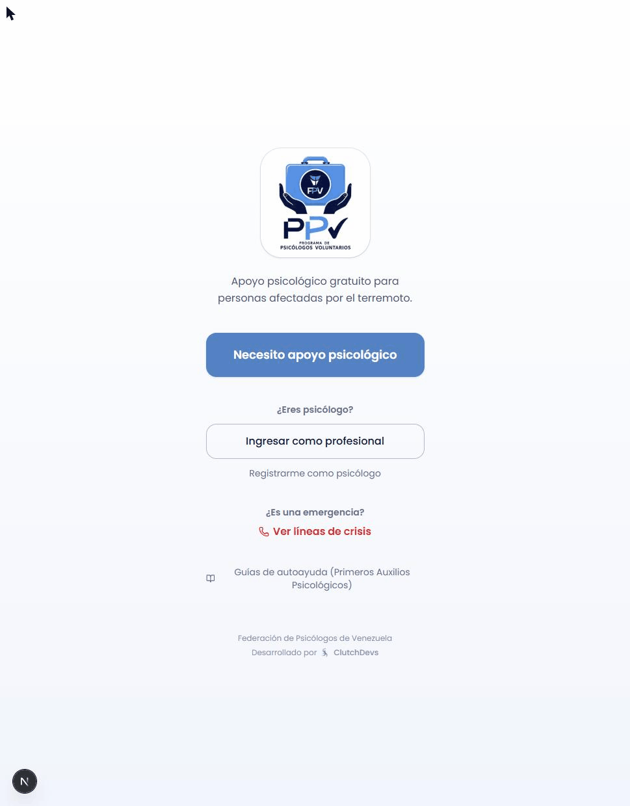

*Pantalla de inicio: el botón azul es la acción principal para quien busca ayuda.*

3. Aparece la pregunta **"¿Cómo te sientes en este momento?"** con 5 opciones. Según la respuesta,
   el sistema enruta a una de dos vías (roja o verde).

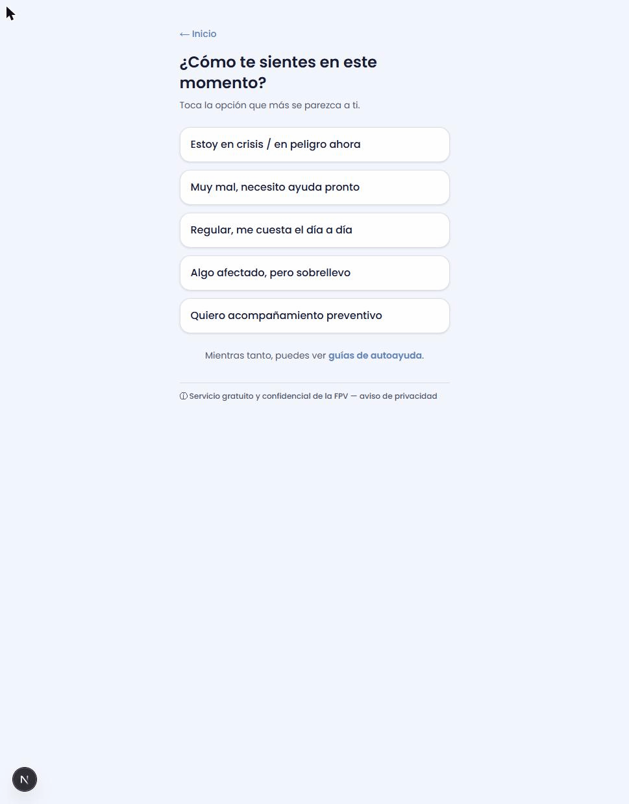

*Triage: la persona indica cómo se siente; eso decide la prioridad y la ruta.*

### A.2 Ruta ROJA (riesgo alto / emergencia)

Si elige *"Estoy en crisis / en peligro ahora"* o *"Muy mal, necesito ayuda pronto"*:
- Se muestran **de inmediato las líneas de crisis** (teléfonos para llamar ya).
- Puede pedir que **lo contacten**: *"Recibir una llamada"* o *"WhatsApp silencioso"*, dejando un
  teléfono en **formato internacional con el código de país** (`+58` + móvil, ej. `+58 414 1234567`)
  y la **edad** (ahora **obligatoria**).
- Al enviar, la solicitud entra a la cola con **prioridad alta**.

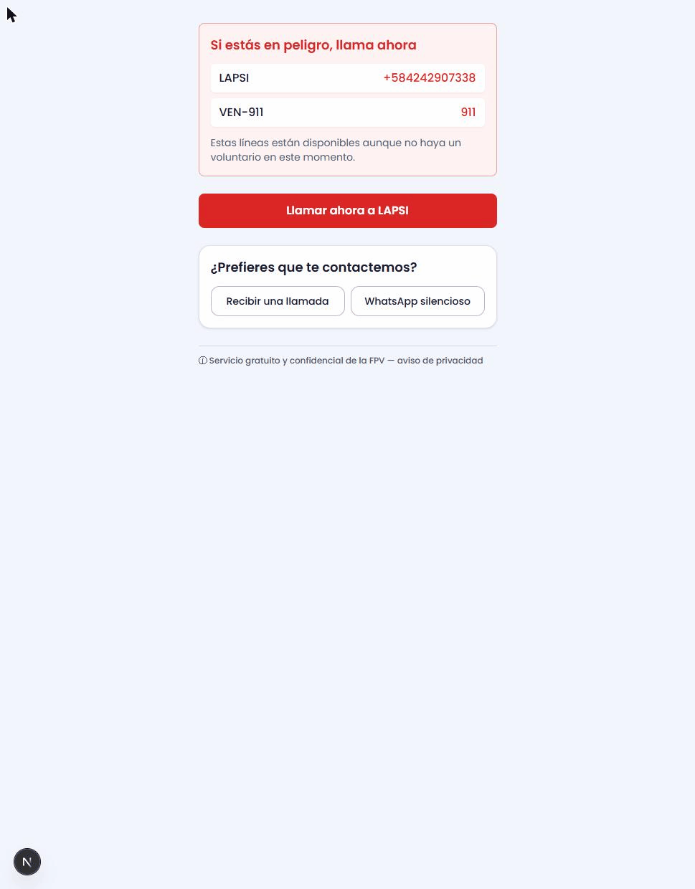

*Ruta roja: líneas de crisis inmediatas + opción de ser contactado.*

### A.3 Ruta VERDE (seguimiento)

Si elige una opción más leve, entra a un formulario de **4 pasos**:
1. **Síntomas** — marca lo que aplique.
2. **Ubicación** — estado (y ciudad opcional).
3. **Hábitos** — cambios recientes (sueño, alimentación…), opcional.
4. **Contacto** — **quién solicita la ayuda** (la persona afectada / un familiar / voluntario),
   nombre (opcional), **edad obligatoria** (ayuda a asignar atención infantil o adulta), teléfono
   **con código de país `+58`** (ej. `+58 414 1234567`) y si prefiere **llamada** o **WhatsApp**.

Al enviar, verá la confirmación de que **un psicólogo voluntario lo contactará**.

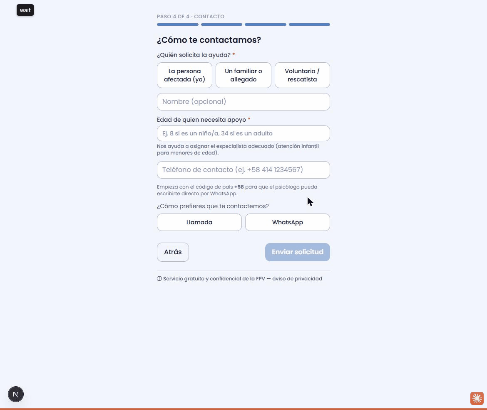

*Ruta verde: formulario por pasos para atención no urgente.*

### A.4 Guías de autoayuda

El enlace **"Guías de autoayuda"** (`/guias`) abre ejercicios de Primeros Auxilios Psicológicos
(respiración, anclaje, sueño, acompañar a un niño, duelo…).

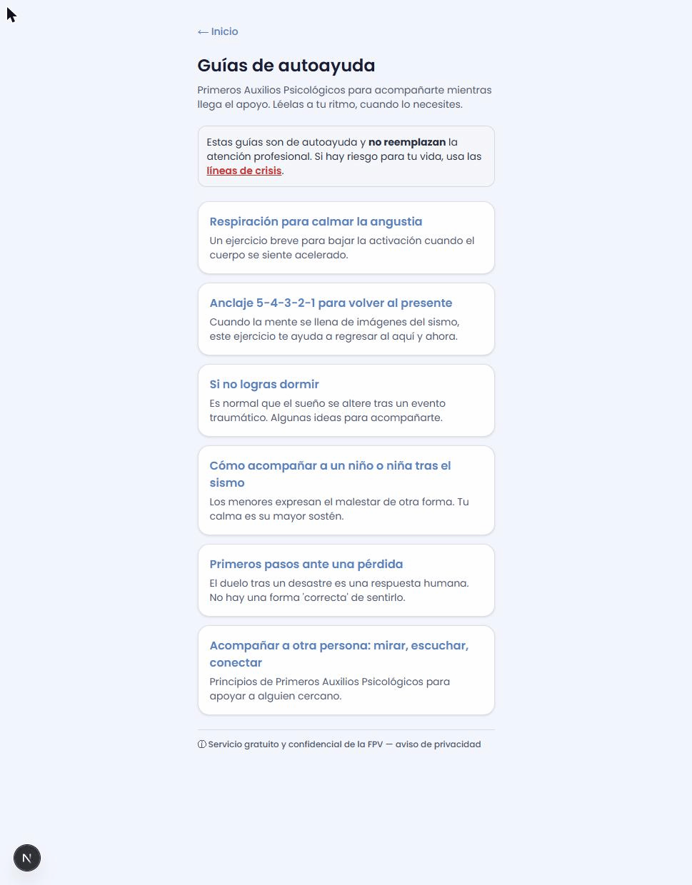

*Guías de autoayuda (Primeros Auxilios Psicológicos).*

> 💡 **Qué probar:** crea varios casos con distintas respuestas (rojas y verdes) y con distintas
> edades (menor y adulto), para ver cómo se clasifican y asignan.

---

## Parte B — Psicólogo voluntario

### B.1 Registrarse

1. En el inicio → **"Registrarme como psicólogo"** (`/registro`).
2. Completa: nombre, documento (V/E/P), **nº FPV**, correo, teléfono, universidad, año de egreso,
   colegio, **país y ciudad de residencia**, modalidad (presencial / a distancia),
   **disponibilidad horaria**, formación en PAP, y **acepta el consentimiento informado** (obligatorio).
3. Al enviar:
   - Si el nº FPV se **valida automáticamente** → cuenta aprobada y llegan las **credenciales por correo**.
   - Si no se puede validar → queda **pendiente de revisión** por un coordinador/administrador.

> ⚠️ En pruebas, si el padrón FPV no está conectado, los registros quedan **pendientes** y un admin
> los aprueba a mano (ver [D.1](#d1-excepciones-de-registro-admin)). Alternativa: que el equipo
> técnico cree la cuenta directamente.

### B.2 Entrar y ponerse disponible

1. Inicio → **"Ingresar como profesional"** (`/login`) → correo + contraseña.
2. Entras al **portal del psicólogo**.
3. Arriba a la derecha, pon el interruptor en **"Disponible"** 🟢 para **recibir casos** (déjalo así
   con la pestaña abierta; en "En pausa" no se te asignan casos).

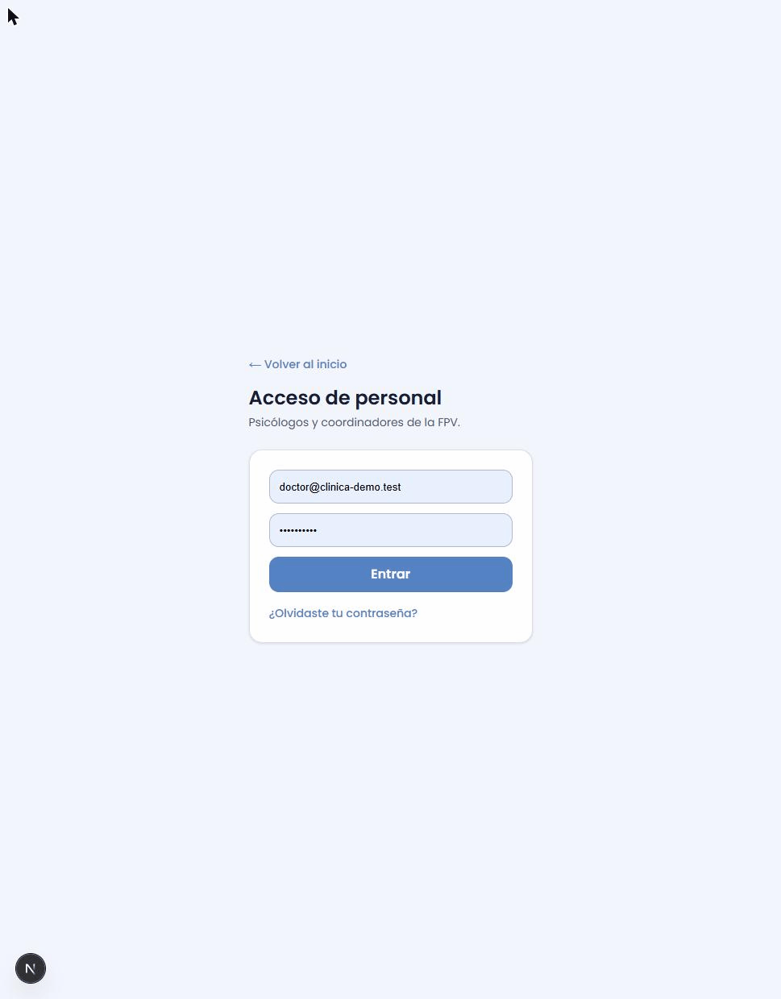

*Inicio de sesión del personal (psicólogos y coordinadores).*

### B.3 Tus casos

**Inicio** (`/psicologo`): saludo, indicadores (nuevos / en curso / atendidos este mes) y tus casos activos.

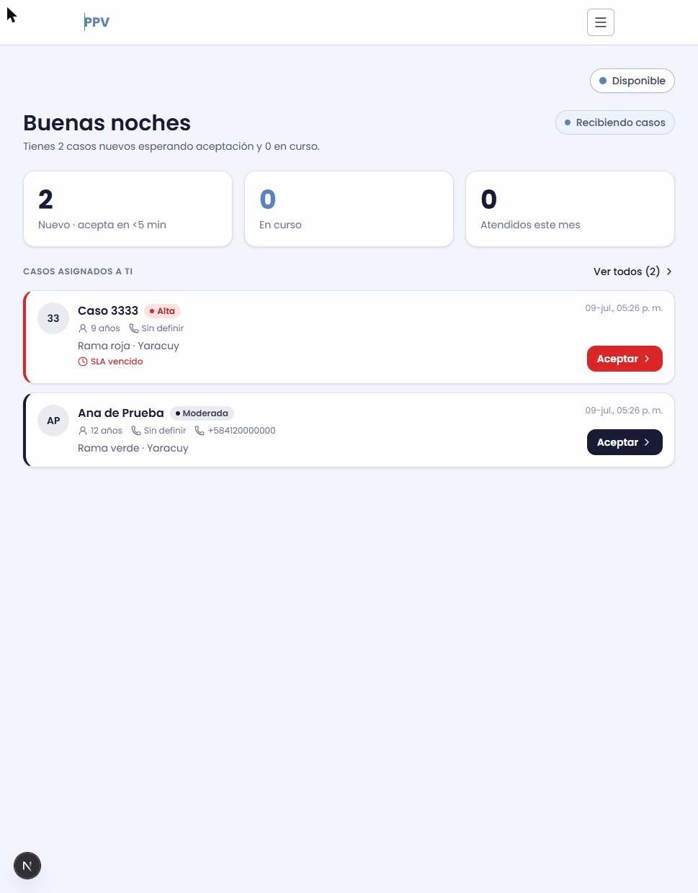

*Portal del psicólogo: indicadores y casos activos.*

**Mis casos** (`/psicologo/casos`): lista completa con **filtros** (Estado: Activos / Cerrados / Todos ·
Riesgo · Rama) y un botón **"Limpiar filtros"**. La lista **se auto-refresca** (no hace falta recargar).
En los casos **aún sin aceptar**, el teléfono aparece **censurado** (🔒 `+58 ••• •••••••`); se revela al
aceptar.

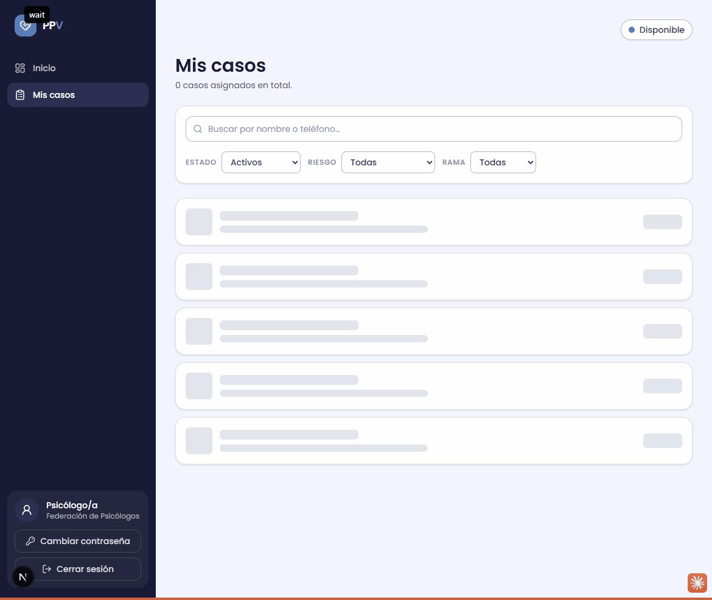

*"Mis casos": por defecto muestra los activos; el teléfono se censura hasta aceptar el caso.*

### B.4 Atender un caso

1. Abre un caso de tu lista. Verás su ficha con el **riesgo**, la **edad**, y las **respuestas del
   solicitante**: los **síntomas** que marcó y **"¿Cómo se siente?"** (su respuesta inicial de urgencia).
2. Si está **asignado** (nuevo), el **contacto está oculto** (para no contactar antes de tiempo y no
   distorsionar las métricas). Toca **"Aceptar caso"** → **entonces** se revelan el nombre y el teléfono
   (con botones **Llamar** y **WhatsApp**).
3. Con el caso **aceptado** puedes:
   - **Registrar notas clínicas** (con reglas de seguridad, p. ej. el TEPT no se registra antes de 4
     semanas del evento).
   - **Cerrar el caso** con el formulario de cierre estructurado (contactabilidad, síntomas, técnicas,
     motivo, derivación y **minutos** de atención — números enteros, mínimo 1). El **destino de la
     derivación** admite **más de un especialista** (se marcan varios). El cierre es **definitivo**.

El detalle también **se auto-refresca**, así que si el caso cambia de estado lo verás sin recargar.

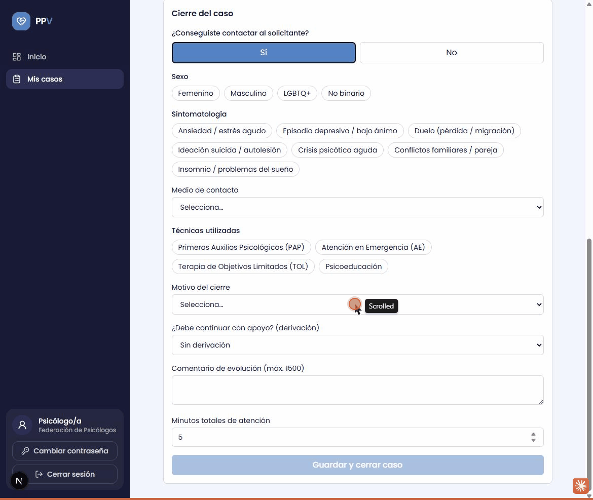

*Detalle del caso: al aceptar se revela el contacto; se ven los síntomas y "¿Cómo se siente?" del
solicitante, y el cierre se registra en minutos.*

En el cierre, si marcas una **derivación** (Urgente o Seguimiento), el **destino** permite elegir
**varios** especialistas a la vez.

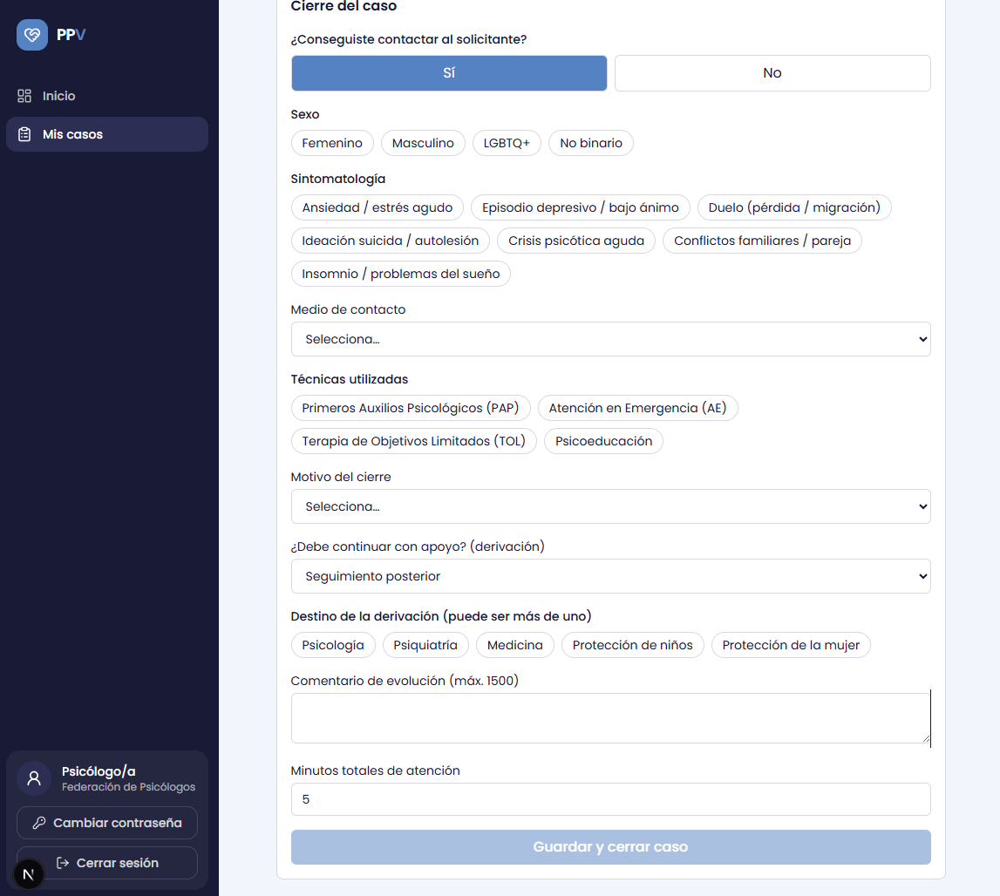

*Destino de la derivación: se pueden marcar varios especialistas para un mismo paciente.*

> 💡 **Qué probar:** ponte disponible, recibe un caso, comprueba que el teléfono está censurado,
> acéptalo (aparece el contacto y las respuestas del solicitante), agrega una nota y ciérralo con los
> minutos de atención. Verifica que sale de "Activos" y aparece en "Cerrados".

---

## Parte C — Coordinador

### C.1 Activar la cuenta (por invitación)

1. Un administrador te **invita por correo** (ver [D.5](#d5-coordinadores-admincoordinadores)). El
   correo trae un enlace a `/registro-coordinador?token=…`. Todo coordinador es primero un
   psicólogo registrado, así que la invitación se envía al correo de un psicólogo existente.
2. Abre el enlace: se **activa automáticamente** el rol de coordinador en tu cuenta (no pide datos
   ni contraseña).
3. Entra por **"Ingresar como profesional"** (`/login`) con tu contraseña de psicólogo; tendrás
   acceso a **ambos portales** (psicólogo y coordinador).

### C.2 Cola de casos en vivo (`/coordinador`)

Indicadores (riesgo alto, en cola, psicólogos en atención, espera promedio), alertas de **SLA vencido**,
y la tabla de casos que **se actualiza sola**. Desde cada caso puedes **Reasignar** o **Cerrar**
administrativamente. Al **Reasignar**, la lista solo ofrece psicólogos **conectados y disponibles**
ahora mismo (para no dejar el caso con alguien ausente y vencer el SLA). Además, si un psicólogo entra
en **pausa** con un caso asignado **que aún no aceptó**, ese caso **vuelve a la cola** automáticamente.
Y si **vence el SLA** de un caso de alto riesgo sin que lo acepten, el sistema lo **reasigna solo a otro
voluntario disponible** (distinto del que no aceptó) en cuanto haya uno en línea.

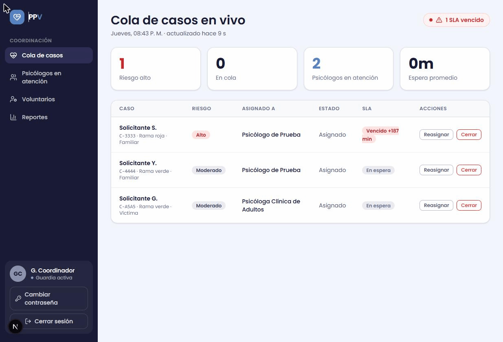

*Cola en vivo: casos priorizados por urgencia, con alertas de SLA.*

### C.3 Psicólogos en atención (`/coordinador/psicologos`)

Quién tiene casos activos asignados ahora mismo y cuántos.

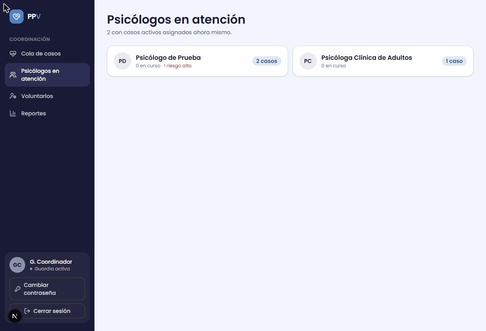

*Carga de trabajo por psicólogo.*

### C.4 Voluntarios (`/coordinador/voluntarios`)

**Aprobar / suspender** psicólogos y dejar **notas confidenciales**. Con búsqueda, filtros por estado,
un filtro **"Disponibles ahora"** (solo los psicólogos en línea en este momento; mientras está activo la
lista se refresca sola) y un botón **"Limpiar filtros"**.

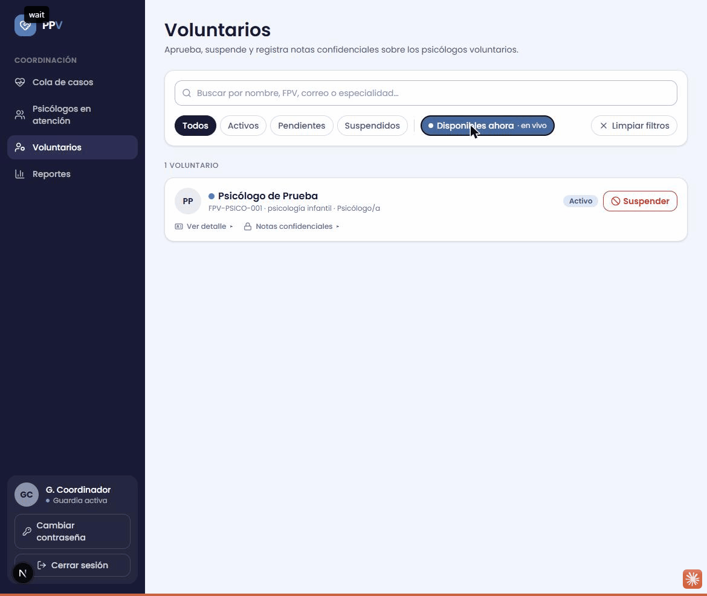

*Gestión de voluntarios: aprobar, suspender y notas confidenciales.*

### C.5 Reportes (`/coordinador/reportes`)

Estado operativo de la cola por categoría de riesgo.

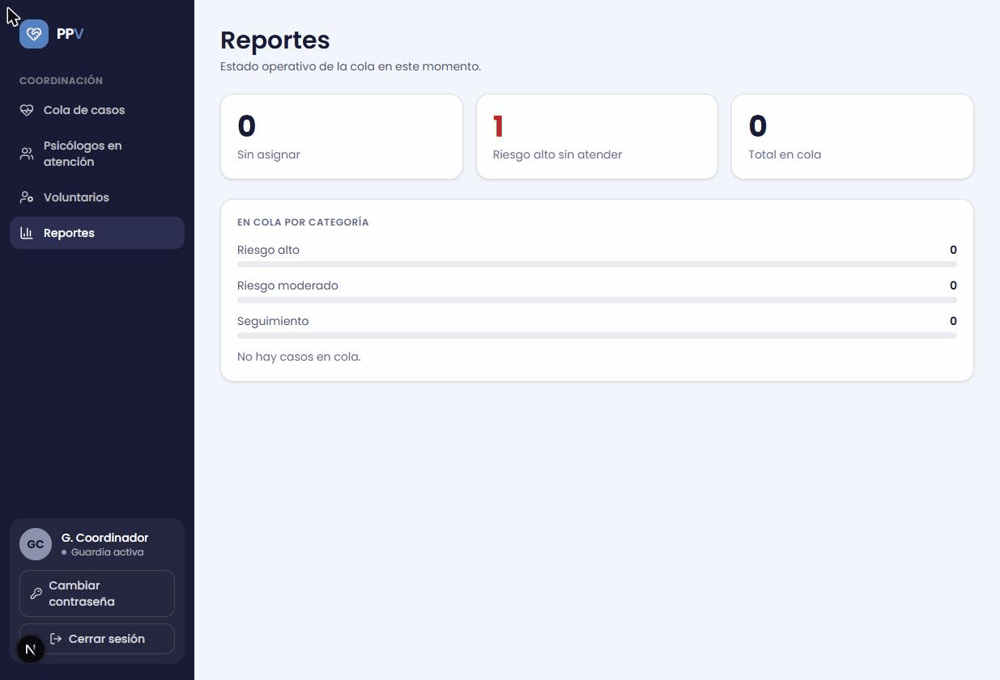

*Reportes: cola por categoría de riesgo.*

> 💡 **Qué probar:** con un caso en cola, reasígnalo a un psicólogo; suspende y reactiva un
> voluntario; revisa que los indicadores cuadren.

---

## Parte D — Administrador

Entra por `/login` → panel **`/admin`**. En escritorio hay un menú lateral; en móvil, el **ícono de
hamburguesa** ☰ arriba a la derecha.

### D.1 Excepciones de registro (`/admin`)

Psicólogos que **no se validaron automáticamente**. Puedes **Aprobar** (se activan y reciben
credenciales por correo) o **Rechazar** cada uno.

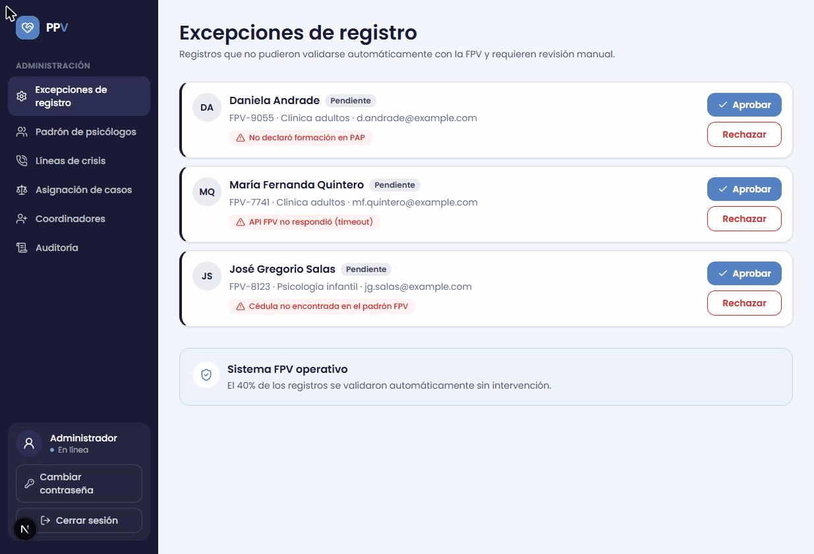

*Excepciones de registro pendientes de revisión.*

### D.2 Padrón de psicólogos (`/admin/padron`)

Listado de **todas** las personas registradas, con búsqueda y filtro por estado. Solo lectura.

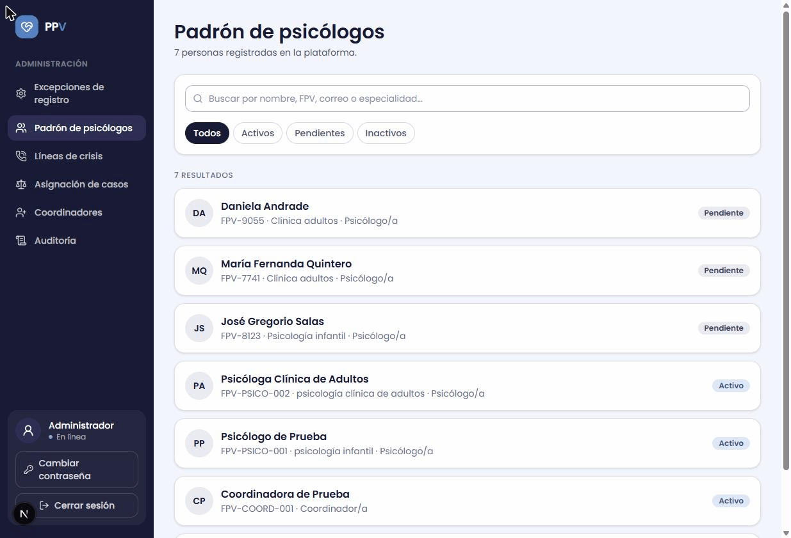

*Padrón completo de psicólogos registrados.*

### D.3 Líneas de crisis (`/admin/lineas`)

**Crear / editar / activar / desactivar / eliminar** las líneas de crisis que ve el público. El
formulario de creación está **arriba** de la lista. Cada línea tiene nombre, teléfono, cobertura,
prioridad y una **franja horaria opcional** en formato **24 h (0–24)** con **días de la semana** para el
ruteo automático (p. ej. una línea de 20:00 a 02:00). **Desactivar** la oculta temporalmente;
**Eliminar** la borra de forma **definitiva** (pide confirmación).

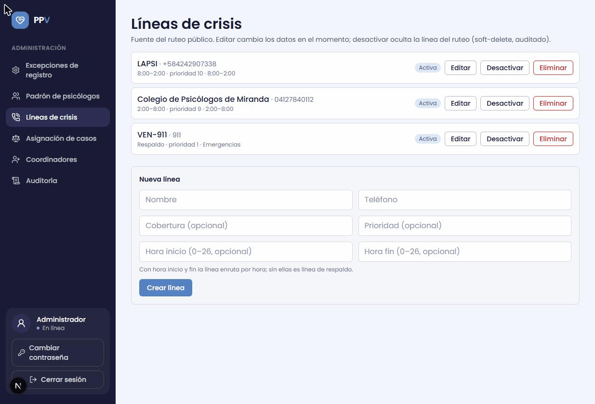

*Administración de las líneas de crisis.*

### D.4 Asignación de casos (`/admin/asignacion`)

Define el **tope de casos activos por psicólogo** (balanceo de carga). Los casos de **alto riesgo**
pueden exceder el tope para no quedar sin atención.

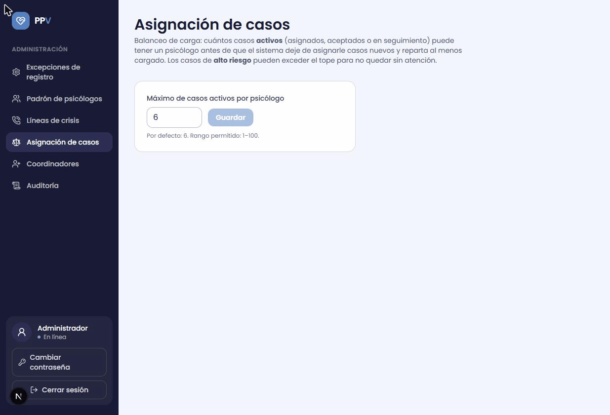

*Tope de casos activos por psicólogo.*

### D.5 Coordinadores (`/admin/coordinadores`)

**Invitar coordinadores** por correo (el token también se muestra una vez por si hay que compartirlo a
mano) y **revocar** invitaciones pendientes.

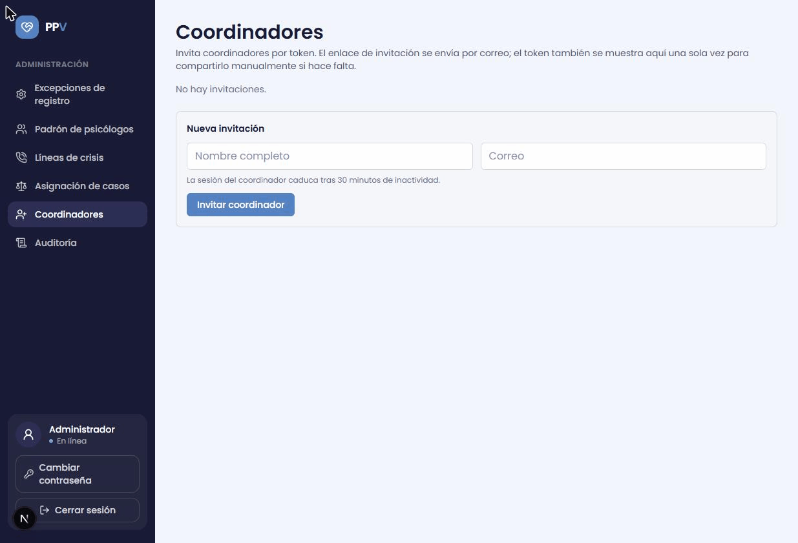

*Invitación y gestión de coordinadores.*

### D.6 Auditoría (`/admin/auditoria`)

Registro **inmutable** de las acciones sensibles (quién hizo qué y cuándo), con filtro y paginación. No
se puede editar ni borrar (por diseño).

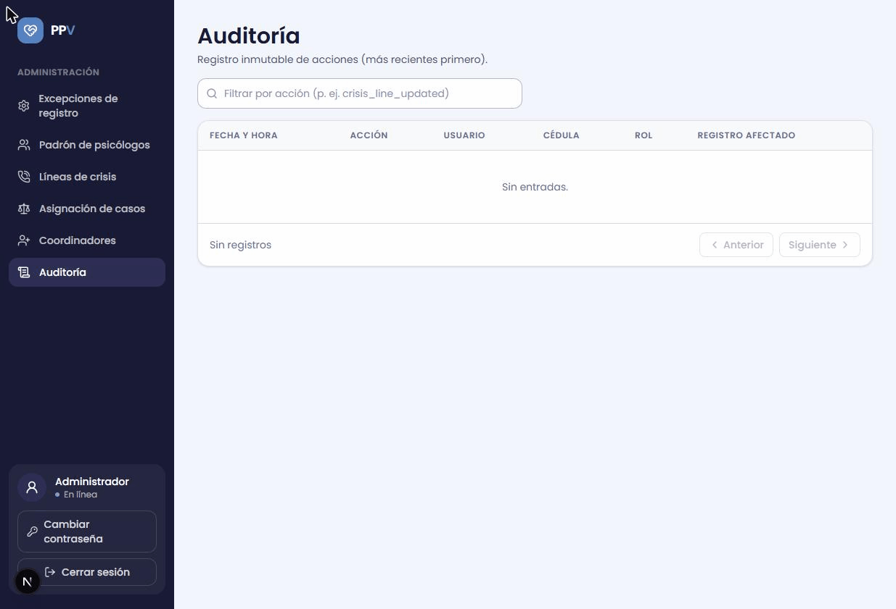

*Registro de auditoría (append-only).*

> 💡 **Qué probar:** aprueba un registro pendiente; crea una línea de crisis y compruébala en el
> intake; cambia el tope de asignación; invita a un coordinador; revisa que todo quede en Auditoría.

---

## Guion de pruebas sugerido (recorrido end-to-end)

Un recorrido que ejercita todo el sistema, en orden:

1. **Admin** → crea/verifica una **línea de crisis** → ajusta el **tope de asignación** → **invita a un
   coordinador**.
2. **Coordinador** activa su cuenta desde el correo de invitación e inicia sesión.
3. **Psicólogo** se registra (o el admin lo crea) → el **admin lo aprueba** en Excepciones → el
   psicólogo inicia sesión y se pone **"Disponible"**.
4. **Solicitante** (sin cuenta) crea **dos casos**: uno **rojo** (emergencia) y uno **verde** (seguimiento).
5. El caso **se auto-asigna** al psicólogo en línea → el psicólogo lo **acepta**, agrega una **nota** y
   lo **cierra**.
6. **Coordinador** revisa la **cola en vivo**, **reasigna** o cierra un caso, y mira **Reportes**.
7. **Admin** revisa la **Auditoría** para ver el rastro de todas esas acciones.

---

## Notas para las pruebas

- Es un **entorno de pruebas**: los datos son ficticios y se pueden borrar. El equipo técnico puede
  **limpiar la base** entre rondas (deja la configuración y los admins).
- **Teléfonos del solicitante**: móviles venezolanos **con código de país `+58`** (ej. `+58 414 1234567`);
  ya no se acepta el `0` inicial (así el enlace de WhatsApp del psicólogo funciona directo).
- **Un caso abierto por persona**: si el mismo teléfono envía otra solicitud mientras tiene un caso
  abierto, se **reutiliza** ese caso (no se duplica); podrá abrir uno nuevo una vez cerrado el anterior.
- **Edad**: ahora es **obligatoria** en el intake (roja y verde).
- **Cédulas**: hasta 8 dígitos (V/E); pasaporte (P) alfanumérico.
- **Correos reales**: si el envío SMTP está activo, las aprobaciones/invitaciones llegan a la bandeja
  (revisen también **spam**). Si no, el equipo técnico comparte las credenciales/tokens.
- **Disponibilidad del psicólogo**: para recibir casos debe estar **"Disponible"** con la pestaña
  abierta. Si se desconecta, deja de recibir casos nuevos (pero conserva los que ya aceptó).
- **En móvil**: el menú de cada portal está en el **ícono de hamburguesa** ☰ arriba a la derecha.

---

*Cualquier duda o hallazgo durante las pruebas, anótenlo con la pantalla (rol), lo que hicieron y lo
que esperaban vs. lo que pasó — así el equipo lo reproduce y corrige rápido.*
