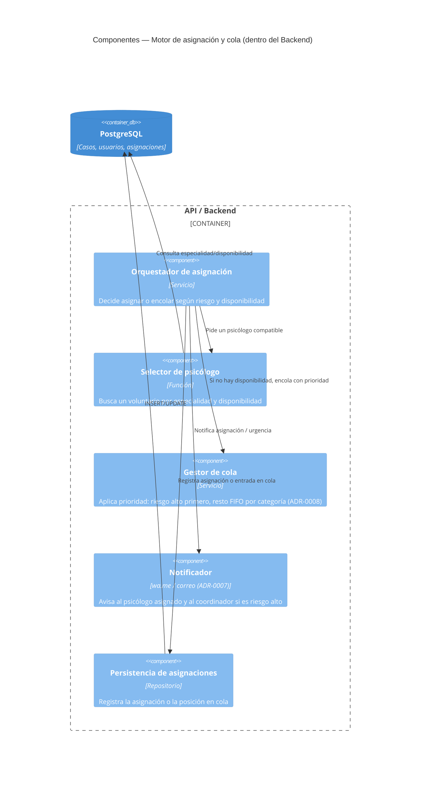

# C4 — Componentes: Motor de asignación / cola

> **Fase AI-DLC:** `02-design`  ·  Nivel 3 (Componentes dentro del backend).
> Entrada: caso clasificado. Salida: asignación a voluntario, o entrada en cola con mensaje honesto.

## Reglas de asignación y cola (ADR-0008)
1. **Riesgo alto:** marcado urgente en el panel del coordinador; las líneas de crisis ya se
   mostraron en el triage, con independencia de la asignación.
2. **Riesgo moderado/seguimiento:** se busca un psicólogo por especialidad y disponibilidad.
3. Si **no** hay disponibilidad inmediata → el caso entra en cola visible:
   - Riesgo alto siempre primero.
   - Moderado y seguimiento por orden de llegada dentro de su categoría.
   - Se devuelve al usuario un **mensaje honesto de espera** y se repiten las líneas de crisis.
4. El **panel de capacidad** del coordinador refleja los casos sin asignar en tiempo real.
