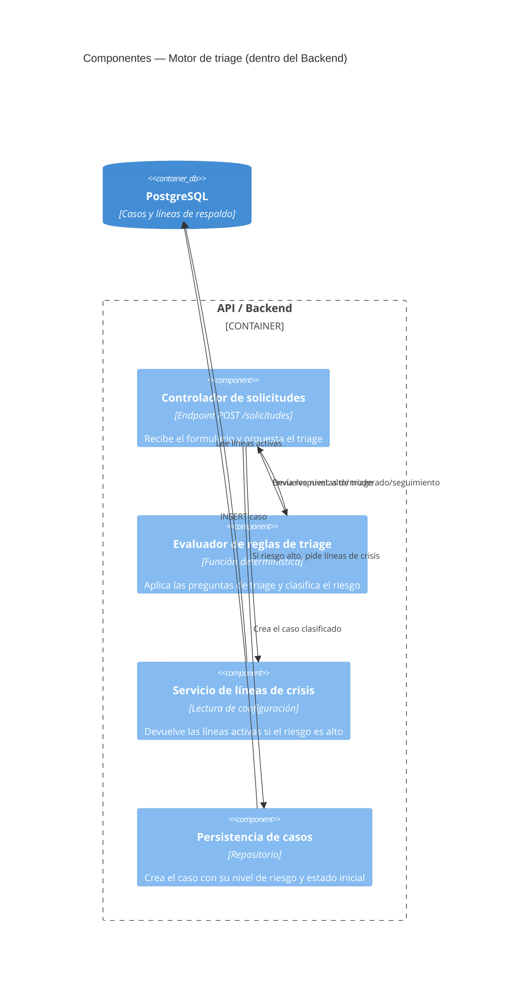

# C4 — Componentes: Motor de triage

> **Fase AI-DLC:** `02-design`  ·  Nivel 3 (Componentes dentro del backend).
> Entrada: respuestas del formulario. Salida: nivel de riesgo + acción.
> **Determinístico (reglas), no ML ni biometría.**

## Reglas de clasificación (determinísticas)
A validar por un psicólogo del gremio (ver plan, sección 6):

| Condición | Resultado |
|---|---|
| "Pensamientos de hacerse daño / no querer seguir viviendo" = **sí** | `riesgo_alto` |
| "Ver/oír/sentir cosas que otros dicen que no ocurren" = **sí** | `riesgo_alto` |
| Necesita hablar **hoy mismo** (sin señales de riesgo alto) | `riesgo_moderado` |
| Puede esperar a los próximos días | `seguimiento` |

> Si **cualquier** condición de riesgo alto se cumple, el resultado es `riesgo_alto` y se muestran
> las líneas de crisis de inmediato, antes de cualquier asignación.
