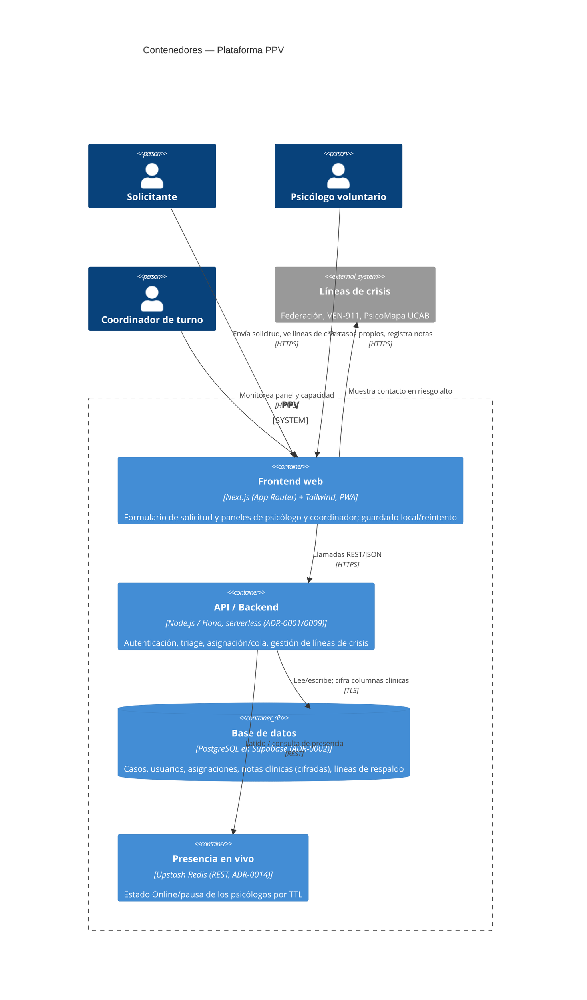

# C4 — Diagrama de contenedores

> **Fase AI-DLC:** `02-design`  ·  Nivel 2 (Contenedores del sistema PPV).
> El motor de triage es un contenedor **lógico dentro del backend**, no un servicio separado.

**Notas**
- Cifrado en tránsito (HTTPS/TLS) y en reposo por columna para datos clínicos (ADR-0004).
- El frontend muestra las líneas de crisis directamente al solicitante (datos provistos por la API).
