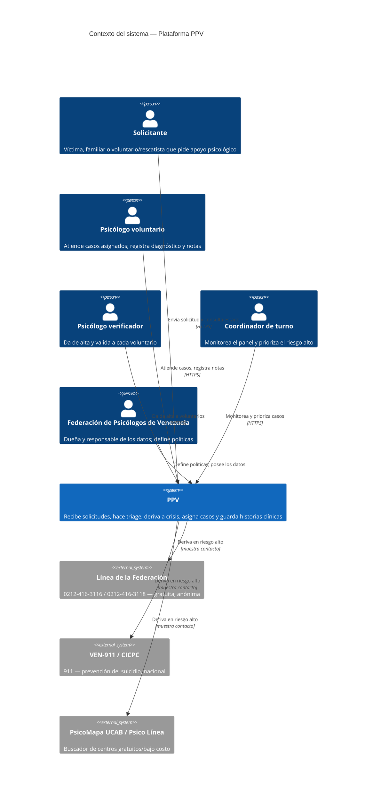

# C4 — Diagrama de contexto

> **Fase AI-DLC:** `02-design`  ·  Nivel 1 (Sistema en su entorno).
> Las líneas de crisis son **destinos de derivación**, no integraciones técnicas.

**Notas**
- La derivación a líneas de crisis ocurre **antes e independientemente** de cualquier asignación.
- La Federación es actor dueño de datos (ADR-0003), no un sistema externo.
